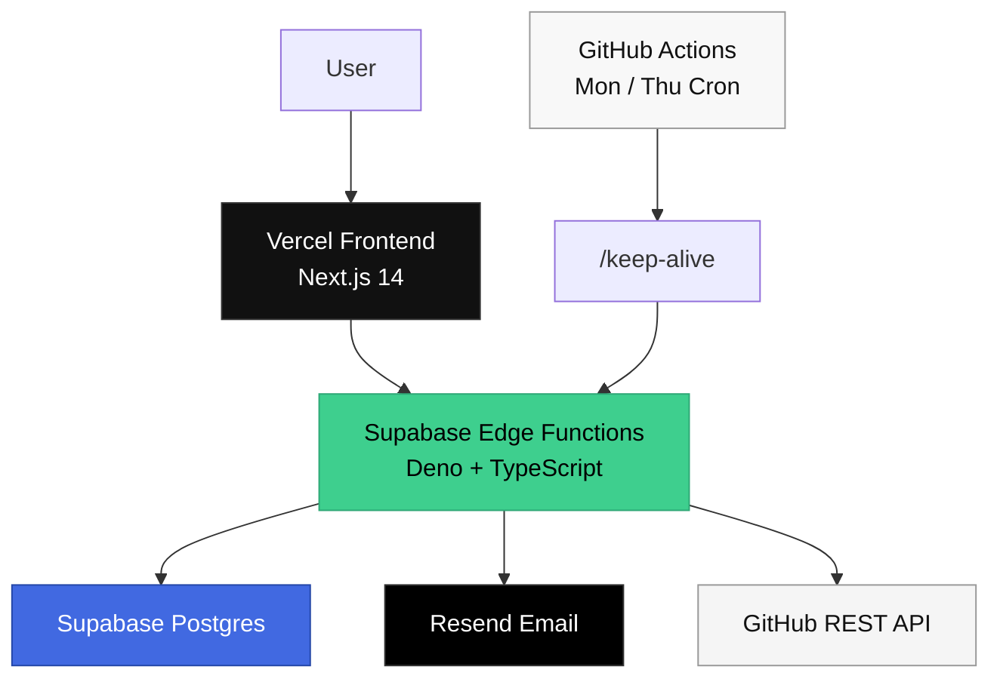

<div align="center">

# 팀사랑꾼들 · vibe-lovers

### Music · Archive · Letters · Creative Engineering

군대에서 탄생한 팀사랑꾼들닷컴.  
음악, 영상, 프로젝트, 편지를 하나의 흐름으로 담는 풀스택 아카이브 웹사이트입니다.

<br />

<a href="https://www.weareteamlovers.com">
  
</a>


<br />
<br />

 **AI MUSIC DESIGN AND LOVE**

</div>

---

## Table of Contents

- [Overview](#overview)
- [Live Service](#live-service)
- [Architecture](#architecture)
- [Features](#features)
- [Tech Stack](#tech-stack)
- [API Reference](#api-reference)
- [Project Structure](#project-structure)
- [Environment Variables](#environment-variables)
- [Development](#development)
- [Deployment](#deployment)
- [Keep Alive](#keep-alive)
- [Operations](#operations)
- [Security Notes](#security-notes)
- [Migration Note](#migration-note)
- [License](#license)

---

## Overview

`vibe-lovers`는 팀사랑꾼들의 정체성을 웹으로 아카이빙하기 위한 풀스택 서비스입니다.

단순한 포트폴리오가 아니라, 음악과 미디어, GitHub 프로젝트, 방문자의 편지를 하나의 감성적인 경험으로 연결하는 웹사이트입니다.

### What this service does

| Area | Description |
|---|---|
| Music | 트랙 정보와 가사를 보여주는 음악 쇼케이스 |
| Media | 이미지, 영상, 전시성 콘텐츠를 보여주는 미디어 섹션 |
| Projects | GitHub API 기반 프로젝트 아카이브 |
| Letters | 이름 또는 익명으로 편지를 남기는 기능 |
| Admin | 편지 확인, 읽음 처리, 삭제를 위한 관리자 페이지 |
| Email | 새 편지 도착 시 Resend 이메일 알림 |
| Automation | GitHub Actions 기반 Supabase keep-alive |

---

## Live Service

| Type | URL |
|---|---|
| Website | `https://www.weareteamlovers.com` |
| API Base | `https://nchjhivxvnlzswdqvcqp.supabase.co/functions/v1/api` |

---

## Architecture



### Current production flow

```txt
User
  ↓
Vercel Frontend
  ↓
Supabase Edge Functions
  ↓
Supabase Postgres
  ↓
Resend Email Notification
```

### Keep-alive flow

```txt
GitHub Actions
  ↓
Protected /keep-alive endpoint
  ↓
Supabase Edge Function
  ↓
Supabase Postgres ping
```

---

## Features

### Public Website

| Feature | Status |
|---|---|
| Responsive landing page | Done |
| Hero section | Done |
| Album preview section | Done |
| Media gallery | Done |
| Full video section | Done |
| Audio player | Done |
| GitHub projects section | Done |
| Contact section | Done |
| Letter submission | Done |

### Letter System

```txt
Visitor writes a letter
  ↓
Supabase Edge Function validates request
  ↓
Letter is stored in Supabase Postgres
  ↓
Resend sends notification email
  ↓
Admin checks letter in dashboard
```

- 이름 또는 익명 편지 작성
- Honeypot field 기반 스팸 방지
- IP hash 기반 간단한 rate limit
- Supabase Postgres 저장
- Resend 이메일 알림
- 관리자 페이지에서 확인 가능

### Admin Dashboard

- 관리자 로그인
- JWT 기반 인증
- 편지 목록 조회
- 편지 상세 조회
- 읽음 처리
- 삭제 처리

### GitHub Projects

- GitHub REST API 기반 repository 조회
- `CachedGithubRepo` 테이블 기반 캐싱
- GitHub API 실패 시 stale cache fallback
- 검색 / 언어 필터 / 정렬 대응 구조

### Keep Alive

- `/keep-alive` endpoint 제공
- `KEEP_ALIVE_TOKEN` 기반 보호
- GitHub Actions 주 2회 자동 ping
- Supabase Free 프로젝트 inactive pause 방지 목적

---

## Tech Stack

### Frontend

| Category | Stack |
|---|---|
| Framework | Next.js 14 |
| UI Library | React 18 |
| Language | TypeScript |
| Styling | Tailwind CSS |
| Animation | Framer Motion |
| Icons | Lucide React |
| Hosting | Vercel |

### Backend

| Category | Stack |
|---|---|
| Runtime | Supabase Edge Functions |
| Runtime Base | Deno |
| Language | TypeScript |
| Database Client | Supabase JS |
| Auth | Custom JWT |
| Email | Resend |
| External API | GitHub REST API |

### Database

| Category | Stack |
|---|---|
| Database | Supabase Postgres |
| Schema / Seed | Prisma |
| Main Tables | `Letter`, `MediaItem`, `Track`, `CachedGithubRepo`, `AdminUser` |

### Automation

| Category | Stack |
|---|---|
| Keep Alive | GitHub Actions |
| Cron | Monday / Thursday |
| Secrets | GitHub Actions Secrets + Supabase Secrets |

---

## API Reference

Base URL:

```txt
https://nchjhivxvnlzswdqvcqp.supabase.co/functions/v1/api
```

### Public API

| Method | Route | Description |
|---|---|---|
| `GET` | `/tracks` | Published track list |
| `GET` | `/media` | Media item list |
| `GET` | `/projects` | GitHub project list |
| `POST` | `/letters` | Submit a new letter |

### Admin API

| Method | Route | Description |
|---|---|---|
| `POST` | `/admin/auth/login` | Admin login |
| `POST` | `/admin/auth/logout` | Admin logout |
| `GET` | `/admin/me` | Get current admin session |
| `GET` | `/admin/letters` | Get letter inbox |
| `GET` | `/admin/letters/:id` | Get one letter |
| `PATCH` | `/admin/letters/:id/read` | Mark letter as read |
| `DELETE` | `/admin/letters/:id` | Delete letter |

### Maintenance API

| Method | Route | Description | Auth |
|---|---|---|---|
| `GET` | `/keep-alive` | Supabase keep-alive ping | `Bearer KEEP_ALIVE_TOKEN` |

---

## Project Structure

```txt
vibe-lovers/
├─ frontend/
│  ├─ app/
│  │  └─ admin/
│  ├─ components/
│  │  ├─ audio/
│  │  ├─ cursor/
│  │  ├─ layout/
│  │  ├─ sections/
│  │  └─ ui/
│  ├─ content/
│  ├─ hooks/
│  ├─ lib/
│  └─ public/
│
├─ supabase/
│  └─ functions/
│     └─ api/
│        ├─ deno.json
│        └─ index.ts
│
├─ backend/
│  ├─ prisma/
│  │  ├─ schema.prisma
│  │  └─ seed.ts
│  └─ src/
│
├─ .github/
│  └─ workflows/
│     └─ supabase-keep-alive.yml
│
├─ docker-compose.yml
├─ LICENSE
└─ README.md
```

> `backend/`에는 Prisma schema, seed script, 그리고 이전 NestJS 백엔드 코드가 남아 있습니다.  
> 현재 production backend는 `supabase/functions/api`의 Supabase Edge Function입니다.

---

## Environment Variables

### Vercel

```env
NEXT_PUBLIC_API_BASE_URL=https://nchjhivxvnlzswdqvcqp.supabase.co/functions/v1/api
NEXT_PUBLIC_SITE_URL=https://www.weareteamlovers.com
```

### Supabase Edge Function Secrets

```env
FRONTEND_ORIGIN=https://www.weareteamlovers.com
CORS_ALLOWED_ORIGINS=https://weareteamlovers.com,http://localhost:3000

ADMIN_EMAIL=...
ADMIN_PASSWORD=...
ADMIN_COOKIE_NAME=teamlovers_admin
JWT_SECRET=...
JWT_EXPIRES_IN=7d

LETTER_ALERT_ENABLED=true
LETTER_ALERT_FROM_EMAIL=Teamlovers Alerts <alerts@weareteamlovers.com>
LETTER_ALERT_TO_EMAIL=teamlovers@icloud.com
RESEND_API_KEY=...

GITHUB_USERNAME=weareteamlovers
GITHUB_TOKEN=
GITHUB_CACHE_TTL_MINUTES=30

KEEP_ALIVE_TOKEN=...
```

Set Supabase secrets:

```bash
npx -y supabase@latest secrets set \
  FRONTEND_ORIGIN="https://www.weareteamlovers.com" \
  CORS_ALLOWED_ORIGINS="https://weareteamlovers.com,http://localhost:3000" \
  ADMIN_EMAIL="..." \
  ADMIN_PASSWORD="..." \
  ADMIN_COOKIE_NAME="teamlovers_admin" \
  JWT_SECRET="..." \
  JWT_EXPIRES_IN="7d" \
  LETTER_ALERT_ENABLED="true" \
  LETTER_ALERT_FROM_EMAIL="Teamlovers Alerts <alerts@weareteamlovers.com>" \
  LETTER_ALERT_TO_EMAIL="teamlovers@icloud.com" \
  RESEND_API_KEY="..." \
  GITHUB_USERNAME="weareteamlovers" \
  GITHUB_CACHE_TTL_MINUTES="30" \
  KEEP_ALIVE_TOKEN="..." \
  --project-ref nchjhivxvnlzswdqvcqp
```

### GitHub Actions Secrets

```env
SUPABASE_KEEP_ALIVE_TOKEN=...
```

---

## Development

### Frontend

```bash
cd frontend
npm install
npm run dev
```

Local URL:

```txt
http://localhost:3000
```

### Supabase Edge Function

Deploy API function:

```bash
npx -y supabase@latest functions deploy api \
  --no-verify-jwt \
  --project-ref nchjhivxvnlzswdqvcqp
```

### Database Seed

Run seed against Supabase Postgres:

```bash
cd backend
DATABASE_URL="Supabase Session pooler URL" npm run db:seed
```

If `backend/.env` already contains the Supabase `DATABASE_URL`:

```bash
cd backend
npm run db:seed
```

> Be careful: the seed script can reset seeded data such as `MediaItem` and `Track`.

---

## Deployment

### Frontend Deployment

Frontend is deployed through Vercel.

```bash
git add frontend
git commit -m "Update frontend"
git push origin main
```

Vercel automatically deploys the latest `main` branch.

### Supabase API Deployment

```bash
npx -y supabase@latest functions deploy api \
  --no-verify-jwt \
  --project-ref nchjhivxvnlzswdqvcqp
```

Then commit the source code:

```bash
git add supabase/functions/api
git commit -m "Update Supabase API"
git push origin main
```

### Seed Deployment

```bash
cd backend
DATABASE_URL="Supabase Session pooler URL" npm run db:seed

cd ..
git add backend/prisma/seed.ts
git commit -m "Update seed data"
git push origin main
```

---

## Keep Alive

GitHub Actions calls the protected keep-alive endpoint twice a week.

```yaml
cron: '0 0 * * 1,4'
```

KST:

```txt
Every Monday 09:00
Every Thursday 09:00
```

Manual run:

```txt
GitHub → Actions → Supabase Keep Alive → Run workflow
```

Endpoint:

```txt
GET /keep-alive
```

Required header:

```txt
Authorization: Bearer KEEP_ALIVE_TOKEN
```

---

## Useful Commands

### Check repository status

```bash
git status
```

### Deploy Supabase Edge Function

```bash
npx -y supabase@latest functions deploy api \
  --no-verify-jwt \
  --project-ref nchjhivxvnlzswdqvcqp
```

### Test projects API

```bash
curl -i "https://nchjhivxvnlzswdqvcqp.supabase.co/functions/v1/api/projects" \
  -H "Origin: https://www.weareteamlovers.com"
```

### Test letter submission

```bash
curl -i -X POST "https://nchjhivxvnlzswdqvcqp.supabase.co/functions/v1/api/letters" \
  -H "Content-Type: application/json" \
  -H "Origin: https://www.weareteamlovers.com" \
  --data '{
    "senderName": "테스트",
    "isAnonymous": false,
    "title": "Supabase 테스트",
    "body": "Supabase Edge Function 편지 전송 테스트입니다.",
    "website": ""
  }'
```

### Test keep alive

```bash
curl -i "https://nchjhivxvnlzswdqvcqp.supabase.co/functions/v1/api/keep-alive" \
  -H "Authorization: Bearer KEEP_ALIVE_TOKEN" \
  -H "Origin: https://www.weareteamlovers.com"
```

### Run seed

```bash
cd backend
DATABASE_URL="Supabase Session pooler URL" npm run db:seed
```

---

## Operations

### Frontend change

```txt
1. Update frontend code
2. Push to main
3. Wait for Vercel deployment
4. Check website
5. Check browser console
```

### Supabase API change

```txt
1. Update supabase/functions/api/index.ts
2. Deploy Supabase Function
3. Test API with curl
4. Push source code to GitHub
5. Check production site
```

### Seed data change

```txt
1. Update backend/prisma/seed.ts
2. Run seed against Supabase DB
3. Confirm data in Supabase Table Editor
4. Push seed.ts
5. Refresh production site
```

### Secret rotation

```txt
1. Update Supabase secrets
2. Redeploy Edge Function
3. Update GitHub Actions secrets if needed
4. Test affected API
```

---

## Security Notes

- Do not commit `.env` files.
- Do not expose `SUPABASE_SERVICE_ROLE_KEY` to the browser.
- Do not commit Resend API keys, GitHub PATs, JWT secrets, or database URLs.
- Rotate secrets immediately if exposed.
- `/keep-alive` is protected by `KEEP_ALIVE_TOKEN`.
- Admin auth is handled with server-side secrets and JWT.
- GitHub Actions and Supabase must share the same keep-alive token value.
- Public API routes should not depend on client-side secrets.

---

## Migration Note

This project was migrated from Render to Supabase to remove cold-start delay caused by Render free-plan sleep mode.

### Before

```txt
Vercel Frontend
→ Render Web Service
→ Render PostgreSQL
→ Resend
```

### After

```txt
Vercel Frontend
→ Supabase Edge Functions
→ Supabase Postgres
→ Resend
→ GitHub Actions keep-alive
```

---

## Roadmap

- Improve admin dashboard UI
- Add richer project filtering
- Add media management interface
- Add letter search and archive mode
- Add analytics for public sections
- Add safer admin password rotation flow

---

## License

MIT

---

<div align="center">

### 팀사랑꾼들

군대에서 탄생한 팀사랑꾼들닷컴.

<br />

```txt
AI MUSIC DESIGN AND LOVE
```

</div>
